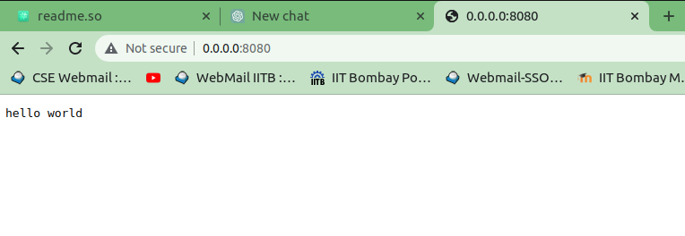
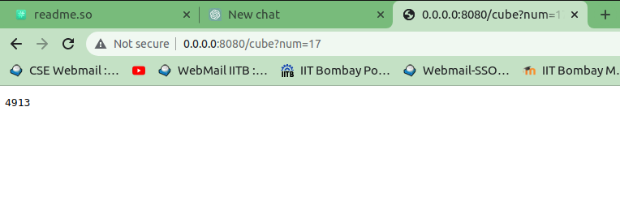
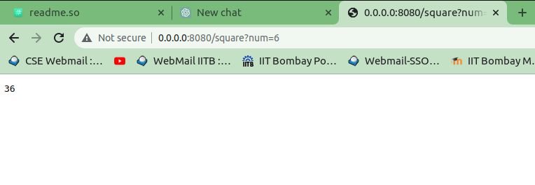
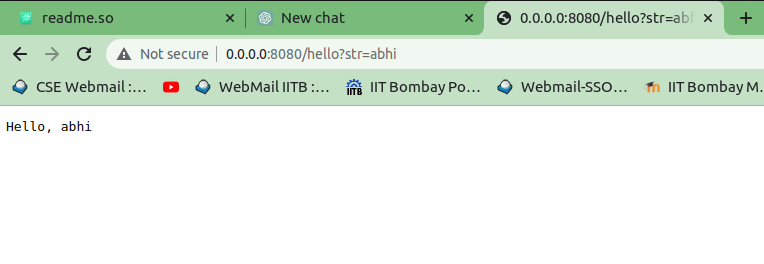
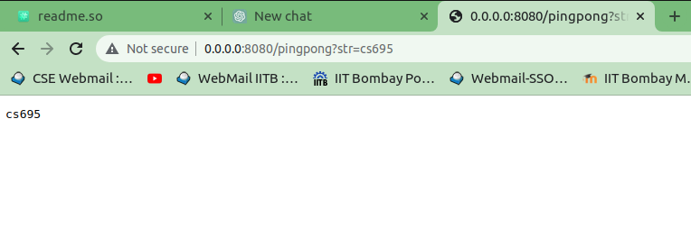
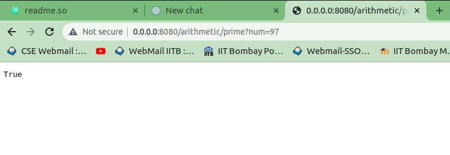
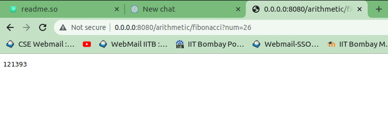
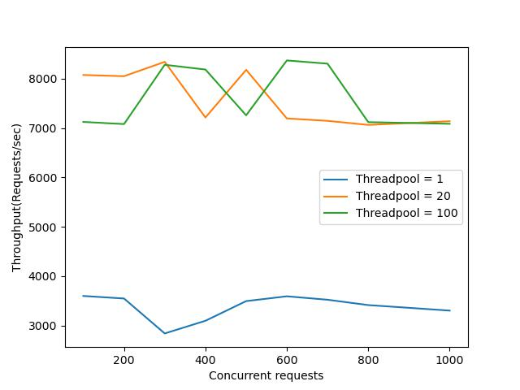
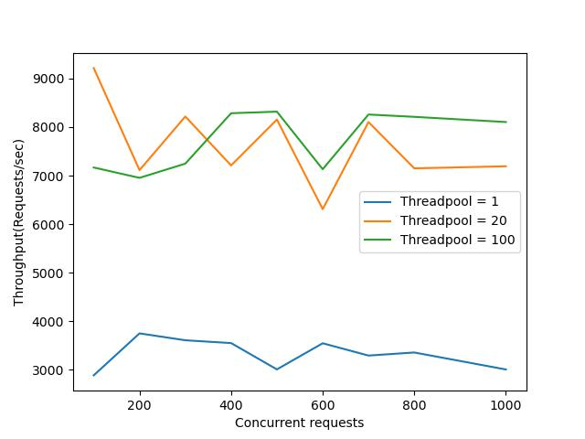
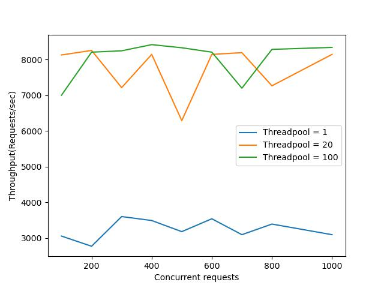

# Task to create webserver using libHTTP and to perform loadtesting 

Task to create Flask’s functionality of adding new functions and exposing them to the web via a URL using libHTTP. Also,   to perform loadtesting to determine how a system behaves under normal and expected levels of usage, as well as to identify bottlenecks and potential points of failure.

## Instruction to execute part 5a
1. All the 4 files(cflask.c, functions.h, functionslist.h, functions.c) should be present in one directory.
```bash
1. cflask.c
2. functions.h
3. functionslist.h
4. functions.c 
````
2. There should be a make file to execute all these files.
```bash
SRC = cflask.c functions.c
```
3. The TOP in make file should be pointing path to libhttp-1.8 directory. Like all the files should be present inside hello directory given in the example folder
```bash
TOP = ../..
```
4. By using make command we can execute the files and ./cflask will be generated
``` bash
make
```
5. Run ./cflask by giving the port number and number of threads and your server will start running
   ex: ./cflask 8080 5
   ```bash 
   ./cflask 8080 5
   ```
6. Open any browser and type the url :- http://0.0.0.0:8080 to check the result
7. For different function present in the problem use specific url. Few example given below:-
```bash
 http://0.0.0.0:8080
 ```
 
```bash
    7.1  http://0.0.0.0:8080/cube?num=17 
```

```bash
    7.2  http://0.0.0.0:8080/square?num=6
```

```bash
    7.3 http://0.0.0.0:8080/hello?str=abhi
```

```bash
    7.4 http://0.0.0.0:8080/pingpong?str=cs695
```

```bash
    7.5 http://0.0.0.0:8080/arithmetic/prime?num=97
```

```bash
    7.6  http://0.0.0.0:8080/arithmetic/fibonacci?num=26
```

## Instruction to execute part 5b
1. For load testing I have used Apache Benchmark
```bash
 ab -n 1000 -c 100 http://SERVER/
```
2. Command used for testing is :- 
```bash
  ab -n 100000 -c 100 http://0.0.0.0:8080/arithmetic/fibonacci?num=40/
 ```
4. Here I have changes the values of -c to see different result. Also tried with different thread values.
```bash
ab -n 100000 -c 200 http://0.0.0.0:8080/arithmetic/fibonacci?num=40/
ab -n 100000 -c 300 http://0.0.0.0:8080/arithmetic/fibonacci?num=40/
ab -n 100000 -c 400 http://0.0.0.0:8080/arithmetic/fibonacci?num=40/
```


## Reporting of experiment
### Aim/Purpose 
Task to create Flask’s functionality of adding new functions and exposing them to the web via a URL using libHTTP. Also,   to perform loadtesting to determine how a system behaves under normal and expected levels of usage, as well as to identify bottlenecks and potential points of failure
### Setup and Execution details
Follow the instruction above to execute the file. 
#### Setup
    1. Model name : Intel(R) Core(TM) i5-8250U CPU @ 1.60GHz
    2. CPU : 8
    3. RAM : 16 GB
    4. Cache : Caches (sum of all):    
        L1d:                  128 KiB (4 instances)
        L1i:                  128 KiB (4 instances)
        L2:                   1 MiB (4 instances)
        L3:                   6 MiB (1 instance)
### Hypothesis/Expectation
Throughput increases and then flattens at a certain load value as the server approaches its max load limits.
### Observations from the Data/Plots
    1. From the plot we can clearly observe that as we increase the number of thread, the throughput also increases.
    2. Initially the fluctuation is very frequent but after certain time it tends to stablize.
    3. The throughput decreases as the number of concurrent requests increases, this may indicate that the system is experiencing performance issues and is   unable to handle the increased load.
    4. As the number of concurrent requests increases, the throughput of the system may also increase, reach a peak, and then decrease.



### Explanation of behavior and inferences
1. In load testing, increasing the number of threads can increase throughput because it allows for more concurrent requests to be handled by the system being tested. 
   When a single thread is used, only one request can be handled at a time. If multiple requests are made simultaneously, they are queued and must wait for the current request to be completed before being processed. This can lead to delays and lower throughput.
   However, when multiple threads are used, each thread can handle a separate request simultaneously. This allows for more requests to be processed at the same time, which can increase throughput.
   Additionally, when using multiple threads, the load is distributed among the threads, thus reducing the chances of overloading a single thread or server, which can improve the performance, and the overall throughput.
2. When a load test is first started, the system may require some time to "warm up" and stabilize. This can include processes such as initializing resources, loading data into memory, and establishing connections. During this time, performance may be affected, which can lead to fluctuations in the results. with time and depending on the load, the system will adapt and stabilize, leading to more consistent results.

## References :-
1. https://stackoverflow.com/questions/6669842/how-to-best-achieve-string-to-number-mapping-in-a-c-program
2. https://stackoverflow.com/questions/840501/how-do-function-pointers-in-c-work